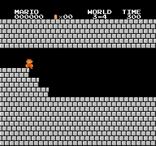
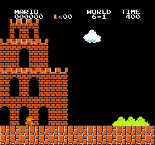

# [PYTORCH] Asynchronous Advantage Actor-Critic (A3C) for playing Super Mario Bros

## Introduction

Here is my python source code for training an agent to play super mario bros. By using Asynchronous Advantage Actor-Critic (A3C) algorithm introduced in the paper **Asynchronous Methods for Deep Reinforcement Learning** [paper](https://arxiv.org/abs/1602.01783).

  
  
   
  
  
   
  
  
   
  <i>Sample results</i>

## Motivation

Before I implemented this project, there are several repositories reproducing the paper's result quite well, in different common deep learning frameworks such as Tensorflow, Keras and Pytorch. In my opinion, most of them are great. However, they seem to be overly complicated in many parts including image's pre-processing, environtment setup and weight initialization, which distracts user's attention from more important matters. Therefore, I decide to write a cleaner code, which simplifies unimportant parts, while still follows the paper strictly. As you could see, with minimal setup and simple network's initialization, as long as you implement the algorithm correctly, an agent will teach itself how to interact with environment and gradually find out the way to reach the final goal.

## Explanation in layman's term
If you are already familiar to reinforcement learning in general and A3C in particular, you could skip this part. I write this part for explaining what is A3C algorithm, how and why it works, to people who are interested in or curious about A3C or my implementation, but do not understand the mechanism behind. Therefore, you do not need any prerequiste knowledge for reading this part :relaxed:

If you search on the internet, there are numerous article introducing or explaining A3C, some even provide sample code. However, I would like to take another approach: Break down the name **Asynchronous Actor-Critic Agents** into smaller parts and explain in an aggregated manner.

### Actor-Critic
Your agent has 2 parts called **actor** and **critic**, and its goal is to make both parts perfom better over time by exploring and exploiting the environment. Let imagine a small mischievous child (**actor**) is discovering the amazing world around him, while his dad (**critic**) oversees him, to make sure that he does not do anything dangerous. Whenever the kid does anything good, his dad will praise and encourage him to repeat that action in the future. And of course, when the kid do anything harmful, he will get warning from his dad. The more the kid interact to the world, and take different actions, the more feedback, both positive and negative, he gets from his dad. The goal of the kid is, to collect as many positive feedback as possible from his dad, while the goal of the dad is to evaluate his son's action better. In other word, we have a win-win relationship between the kid and his dad, or equivalently between **actor** and **critic**.

### Advantage Actor-Critic
To make the kid learn faster, and more stable, the dad, instead of telling his son how good his action is, will tell him how better or worse his action in compared to other actions (or **a "virtual" average action**). An example is worth a thousand words. Let's compare 2 pairs of dad and son. The first dad gives his son 10 candies for grade 10 and 1 candy for grade 1 in school. The second dad, on the other hand, gives his son 5 candies for grade 10, and "punish" his son by not allowing him to watch his favorite TV series for a day when he gets grade 1. How do you think? The second dad seems to be a little bit smarter, right? Indeed, you could rarely prevent bad actions, if you still "encourage" them with small reward.

### Asynchronous Advantage Actor-Critic
If an agent discovers environment alone, the learning process would be slow. More seriously, the agent could be possibly bias to a particular suboptimal solution, which is undesirable. What happen if you have a bunch of agents which simultaneously discover different part of the environment and update their new obtained knowledge to one another periodically? It is exactly the idea of **Asynchronous Advantage Actor-Critic**. Now the kid and his mates in kindergarten have a trip to a beautiful beach (with their teacher, of course). Their task is to build a great sand castle. Different child will build different parts of the castle, supervised by the teacher. Each of them will have different task, with the same final goal is a strong and eye-catching castle. Certainly, the role of the teacher now is the same as the dad in previous example. The only difference is that the former is busier :sweat_smile:

## How to use my code

With my code, you can:
* **Train your model** by running **python train.py**
* **Test your trained model** by running **python test.py**

## Trained models

You could find some trained models I have trained in [Super Mario Bros A3C trained models](https://drive.google.com/open?id=1itDw9sXPiY7xC4u72RIfO5EdoVs0msLL)
 
## Requirements

* **python 3.6**
* **gym**
* **cv2**
* **pytorch** 
* **numpy**
